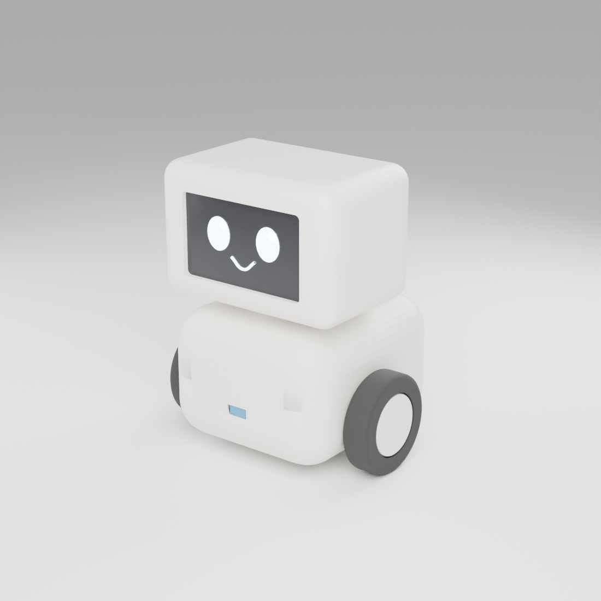
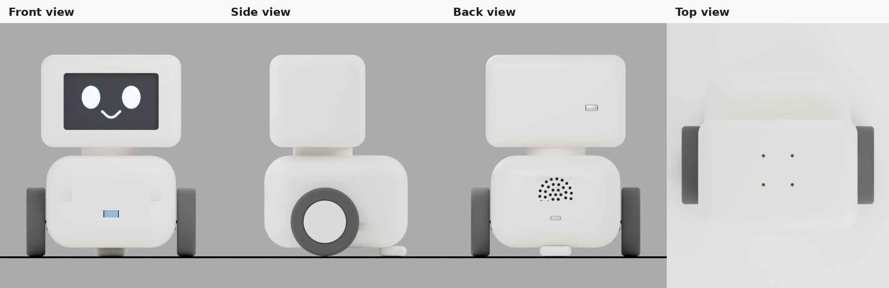
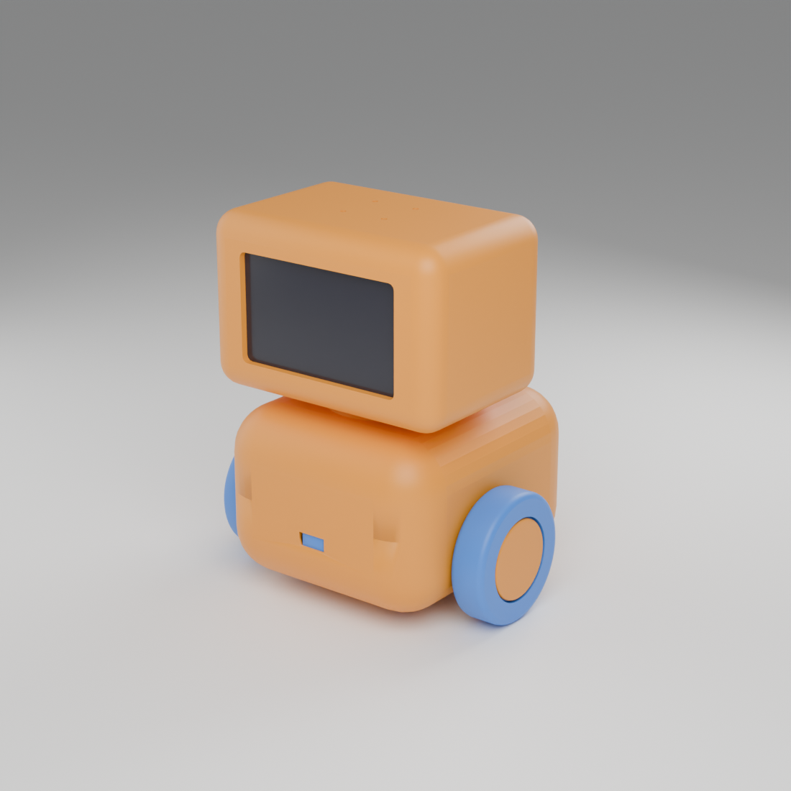
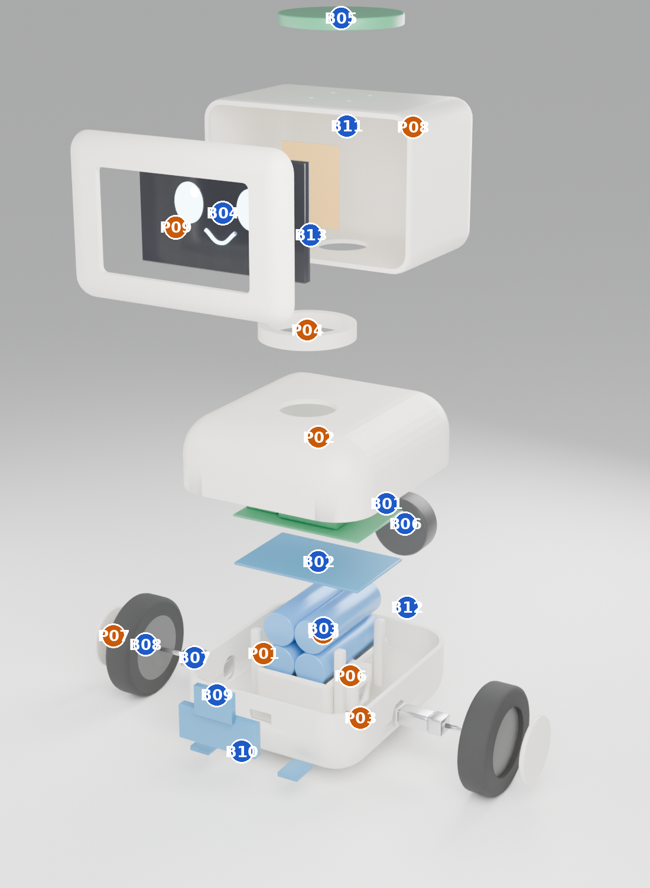
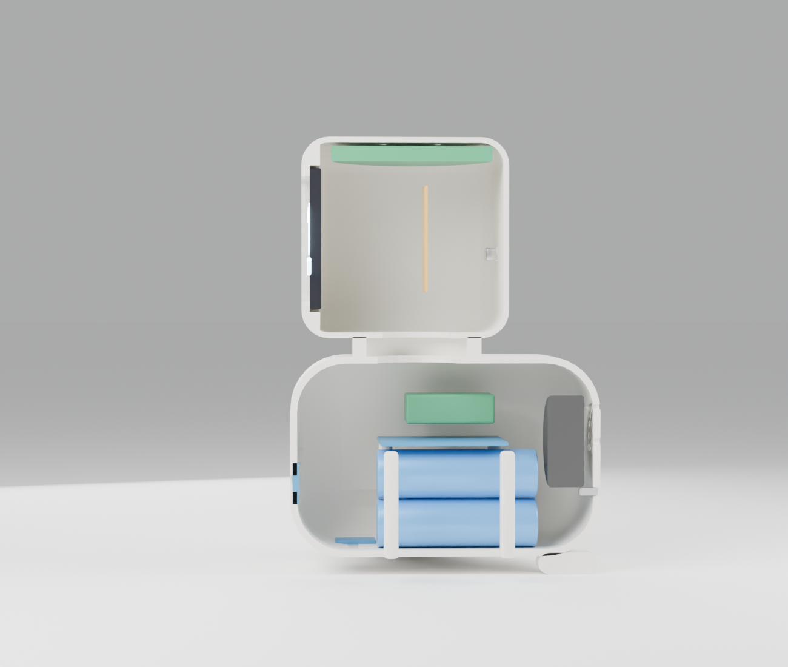
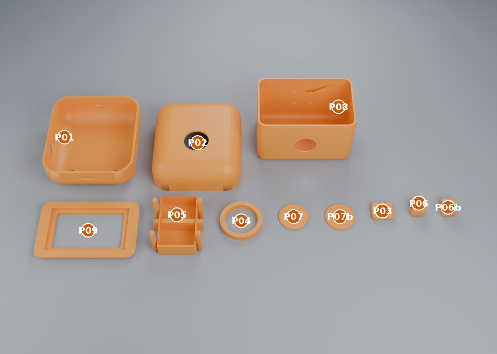
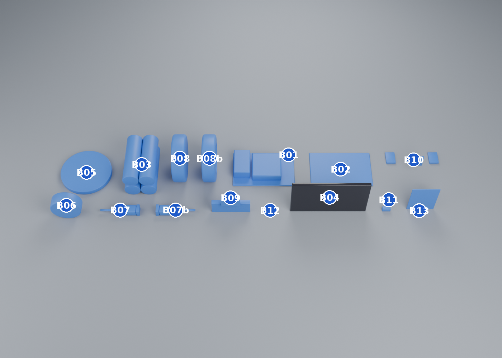

# Artemis: 3D mock-ups (R8)

First 3D mock-up of the body, with every part marked as **printed** or **bought**. It is built from the decisions in the design log and the parts in `docs/shopping-lists.md` (List B, stage 2), and it is meant to answer one question early: *does the assumed 190 x 160 x 135 mm body hold the parts?* (design log row 14, "verify with a CAD mock-up before committing").

**Status: Proposed.** Nothing here is chosen by the owner yet. Most bought-part sizes are my estimates (marked *assumed*), so check them against the real parts before ordering or printing.

**How it was made.** No Blender connector was available in the build session, so the model is a Python script that drives Blender itself (`cad/artemis_mockup.py`, Blender 5.2 as the `bpy` module, run headless). Everything below is regenerated from that script: change a number, run it again, and the renders, the weights and the fit report follow. `cad/artemis_mockup.blend` is the scene to open in Blender. See `cad/README.md`.

See also `docs/shell-styles.md` for the Retro, Mint console and Cassette shell variations (round 9).

## The robot

Same character as the concept render, built from what is decided so far: floor roamer with two wheels and a rear skid, a 4 inch landscape screen for the face, microphones on top, speaker and USB-C at the back. The ears, glow, camera and neck tilt are parked (row 37), so the head is fixed to the body for now.

## What is printed and what is bought

The cutaway shows the stack: battery cells at the bottom, the battery board and Pi above, the speaker at the back, the controller board at the front; in the head the screen at the front and the microphone array under the roof.

### Printed parts (9 designs, 12 pieces)

Per the "fewer, bigger prints" decision (row 19), the body is two big shells and the head is two pieces. Every piece fits a 220 mm print bed. Weights are estimates for PETG or PLA with three walls and a little infill; the real weight will probably be 300 to 400 g in total.

| # | Part | Pieces | Size (mm) | About | Notes |
|---|------|--------|-----------|-------|-------|
| P01 | Lower body shell | 1 | 122 x 135 x 44 | 99 g | Motors, cliff sensors, front distance sensor, skid and USB-C jack mount here. Print floor down. |
| P02 | Upper body shell | 1 | 122 x 135 x 43 | 96 g | Roof, neck seat, speaker grille (37 holes). Print open side down; needs supports under the roof. |
| P03 | Rear skid | 1 | 30 x 26 x 9 | 7 g | Low-friction runner under the tail, two screws. Print the flat face down. |
| P04 | Neck collar | 1 | 56 x 56 x 8 | 9 g | Joins head and body and guides the display cable. Replaced by a tilt mechanism if the neck tilt comes back. |
| P05 | Battery cradle and Pi posts | 1 | 64 x 78 x 45 | 36 g | Holds the four cells; four posts carry the battery board and the Pi. |
| P06 | Motor clamp | 2 | 18 x 20 x 19 | 3 g | One per motor (mirrored). Print with the bore vertical. |
| P07 | Hub cap | 2 | 40 dia x 3 | 4 g | Covers the wheel screw. |
| P08 | Head shell | 1 | 132 x 82 x 87 | 111 g | Holds the mic array under the roof (four sound holes), has the mic-kill switch slot. Print with the back wall down. |
| P09 | Face bezel | 1 | 131 x 8 x 86 | 36 g | Screen window and a pocket that clamps the display. Print face down. |

### Bought parts

These are the parts of List A and List B (stage 2) that sit inside the body. The "From" column says where they come from in `docs/shopping-lists.md`.

| # | Part | Pieces | Size (mm) | From |
|---|------|--------|-----------|------|
| B01 | Raspberry Pi 5 (4 GB) with Active Cooler | 1 | 85 x 56 x 17 | List A row 1, 3 |
| B02 | Battery board (Waveshare UPS HAT (E) type) | 1 | 85 x 56 x 2, *assumed* | List B, power |
| B03 | 21700 cells | 4 | 21.4 dia x 70 | List B, power |
| B04 | Waveshare 4 inch DSI touch display | 1 | 101 x 61 x 5, *assumed* | List A row 6 |
| B05 | reSpeaker XVF3800 microphone array (USB) | 1 | 70 dia x 6.5, *assumed* | List A row 8 |
| B06 | Speaker, 40 mm | 1 | 40 dia x 16, *assumed* | List A row 9 or 11 |
| B07 | N20 gearmotor with encoder | 2 | 12 x 10 x 33, *assumed* | List B, drive |
| B08 | Wheel, 65 mm, rubber tyre | 2 | 65 dia x 18 | List B, drive |
| B09 | Pico 2 with motor driver and motion sensor | 1 | 51 x 21 x 8, *assumed* | List B, controller and sensors |
| B10 | Distance sensors (front and two looking down) | 3 | 13 x 18 x 3 | List B, sensors |
| B11 | Mic-kill slide switch | 1 | 11 x 5 x 5.5 | List B, privacy |
| B12 | USB-C panel jack with a short extension to the battery board | 1 | 9 x 8 x 3 | List B, power |
| B13 | Display ribbon cable (DSI), about 15 cm | 1 | | see the findings below |

Not modelled, but needed: screws and heat-set inserts (M2.5 for the Pi, M3 for the shells), standoffs, wiring and connectors, a fuse and a main switch (List B), and a rubber or foam pad where the cells touch the cradle.

## What the mock-up found

The model comes out at **160 x 135 x 190 mm**, exactly the assumed size, and about **960 g** in total (about 410 g of that printed, by my estimate). The parts fit, but not by a wide margin in a few places.

| Check | Result |
|-------|--------|
| Motor to battery cells (sideways) | 3.5 mm. This only works with short N20 motors and the cells in a 2 x 2 block. A 25 mm motor does not fit without moving the battery. |
| Mic array to the head roof curve | 0.2 mm. The 70 mm disc decides the head depth (82 mm) and forces fairly small roof curves. If the real board is bigger, the head grows. |
| Display top to mic array | 3 mm. |
| Wheel to body side | 1 mm. |
| Pi cooler to body roof | 14 mm spare (room for a vent or a small fan). |
| Speaker back to rear wall | 4 mm. |

Things the numbers show that were not obvious from the concept:

1. **Balance.** With the axle in the middle of the body the robot would tip onto its nose, because the head, screen and cells are all forward of it. Moving the axle 10 mm forward of the middle puts the centre of mass about 5 mm behind the axle, which is between the wheels and the skid. About 8% of the weight then rests on the skid, which is also what a later self-balancing mode wants. Treat this as a first estimate: it assumes the weights above.
2. **The Pi lives in the body, not the head.** This keeps the head light and the centre of mass low (about 67 mm above the floor). The price is a longer screen cable. The shopping list suggests a 12 to 20 cm cable; the path up the neck is closer to 15 to 18 cm, so **buy the 20 cm one**.
3. **The battery layout is the biggest risk.** I assumed the four cells sit 2 x 2 under the battery board. If the real board holds them in a row, the body gets wider or taller. The battery plan also still needs the joint safety review.
4. **Cooling and ports are not solved.** The shell has only the speaker grille. The Pi 5 with its cooler needs air in and out, and its USB, HDMI and network ports face a wall. Servicing means lifting the upper shell off. Both need a decision.
5. **The head has a free bay.** About 10 mm under the screen is empty. That is where a camera, ear servos or a glow ring would go when they come back.

## Open questions for the owner

- Are you happy with a fixed head and the Pi in the body (what is shown here), or do you want the Pi in the head like the concept's exploded view?
- Do you want the printed shells to look like this (rounded, plain, cream), or a different shell first (Minimal, Retro, Creature from the concept)? The script makes it easy to change the shape; colours and the face are separate.
- Vents and a service hatch: back panel, or a part that lifts off?

## Limits

This is a design mock-up, not print-ready CAD. It has no screw bosses, snap fits, tolerances or fillets for printing, and the surfaces are idealised. Do not send it to a printer. Once the bought parts are chosen and measured, the next step is to replace the assumed sizes with real ones, add fixings, and export STL files per part.
