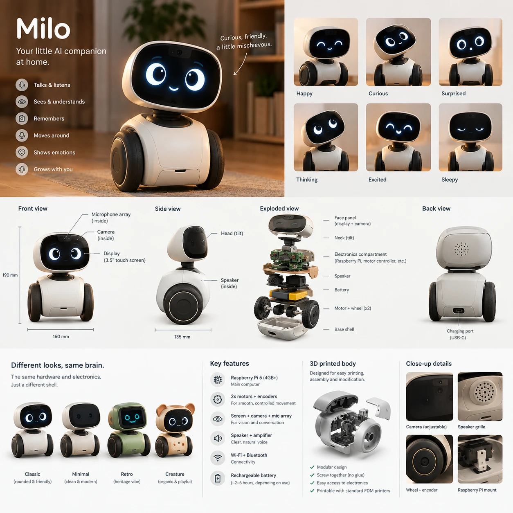

# Milo: Design Log

A living record of the brainstorm for Milo, a small AI companion robot that lives in the apartment. Decisions are logged as they are made; ideas and open questions stay visible until they are resolved.

Status tags:

- **Decided**: chosen by the owner.
- **Assumed**: a working assumption, not yet confirmed.
- **Proposed**: a suggestion on the table, not yet discussed or chosen.

*Concept v0 (generated render). Treat it as a mood board, not an engineering drawing: several details, such as the wheel layout, are still open.*

## 1. Vision

Milo is a small wheeled robot that hangs out in the apartment. A remote AI is its mind; the body gives it a face, a voice and a physical presence. You can talk to it, it has a personality, it remembers you, and the relationship deepens over time.

> Your little AI companion at home. Curious, friendly, a little mischievous.

From the concept: talks and listens, sees and understands, remembers, moves around, shows emotions, grows with you. Concept emotions: Happy, Curious, Surprised, Thinking, Excited, Sleepy.

Reference points mentioned so far: Anki Vector and Cozmo, EMO, Jibo (stationary social robot), Stack-chan (hobbyist desk robot).

## 2. Decisions so far

| # | Topic | Decision | Notes | Status |
|---|-------|----------|-------|--------|
| 1 | Initiative | Alive but polite | The local life layer is always on and free: blinking, glancing, perking up when you walk in, dozing off at night. Milo only starts a conversation at meaningful moments (you got home, it has been quiet for hours), within a daily talking budget. | Decided (R1) |
| 2 | Territory | Floor roamer, table-safe | Follows you room to room. Big wheels, bump and cliff sensing (balcony sills, table edges), a dock, and a neck that tilts up to see faces. | Decided (R1) |
| 3 | Character | Strong fixed character that grows closer | The core personality stays consistent; the relationship (memories, inside jokes, habits) is what evolves. | Decided (R1) |
| 4 | Voice | Natural, expressive voice plus local chirps | Chirps and hums play on the robot for instant reactions (no latency, no LLM cost). | Decided (R1) |
| 5 | Brain and privacy | Cloud AI with hard privacy switches | Audio streams only after the wake word or while a conversation is live. Physical mic-kill switch; camera shutter (head tips down) with an LED to confirm. | Decided (R2) |
| 6 | Language | English only | Widest choice of low-latency voices and wake-word models. Other languages are a later maybe. | Decided (R2) |
| 7 | Household | Mainly the owner, with a partner or roommate sharing the space | The R2 answer was ambiguous ("just me" plus "partner / roommates"); R4 confirmed two people share the house. Design for two people from day one (see row 18). | Decided (R4) |
| 8 | Signature moments | All four: welcome home, company while you work, evening chats, silly play | To be staged; see the roadmap proposal. | Decided (R2) |
| 9 | Usefulness | Companion plus a few perks | Timers, a focus-buddy mode, music, maybe smart-home lights. Character first; no calendar, email or open-ended web agent for now. | Decided (R3) |
| 10 | Stability | Rear skid, balance-ready | Stable at rest and when unpowered. Place weight and wheels so a self-balancing mode can be added later. | Decided (R3) |
| 11 | Extra body language | Ears or antennae (two servos) and a mood glow (LED) | Arms or a lift are deferred (v2 at the earliest). Parked in R7: not part of the first prototype or the first body (row 37). | Decided (R3), parked (R7) |
| 12 | Design log | Keep it in the repo | Committed to the working branch after each round. | Decided (R3) |
| 13 | Name and wake word | Milo, wake word "Hey Milo" | Working name; confirm before a wake-word model is trained. | Assumed |
| 14 | Size | About 190 x 160 x 135 mm, as in the concept | Tight for a Pi 5, a 3.5" screen and a battery; verify with a CAD mock-up before committing. | Assumed |
| 15 | Conversation flow | Wake word plus an open window | Say "Hey Milo" once; the conversation stays open until a few seconds of silence or "thanks, Milo". You can interrupt Milo mid-sentence. Look-to-talk (answering without the wake word when you face Milo) is a possible later add-on. | Decided (R4) |
| 16 | Voice feel | Warm and playful | Mid-pitch, friendly, quick to smile, with a mischievous edge. English; no specific accent chosen yet. | Decided (R4) |
| 17 | Chirp style | Soft, organic, musical | Little coos, trills and warm marimba-like notes: short, quiet and varied. | Decided (R4) |
| 18 | Memory with two people | Private by default | Milo tells people apart (voice and face) and keeps each person's memories separate. Only household-level facts are shared, unless someone says "you can tell them". Staged: v1 can start with just the owner. | Decided (R4) |
| 19 | Printing | Print service or makerspace | Iterations take days, so design fewer, bigger prints and test-fit with cheap parts first. A makerspace can also give hands-on help. | Decided (R5) |
| 20 | Builder experience | Very new to everything, willing to learn | Prefer plug-in modules, ready-made HATs and kits, with as little soldering as possible. Code is written and packaged to run with a few commands. This log explains why, not just what. | Decided (R5) |
| 21 | Budget | About 250 to 500 (euro or dollar terms), parts only, first prototype | Realistic for the concept spec. To be priced properly once parts are chosen. | Decided (R5) |
| 22 | First build | Software Milo first | A browser simulator before any hardware; hardware can be ordered in parallel. Version 0 exists: `sim/index.html`. | Decided (R5) |
| 23 | Mind (text) | DeepSeek API | Chosen by the owner. As far as we know the DeepSeek chat API is text-only, so "sees and understands" needs another model later (to verify). | Decided (owner) |
| 24 | Voice (text to speech) | Fish Audio | Chosen by the owner. | Decided (owner) |
| 25 | Images | OpenAI API, if needed | For image generation such as concept art and shell ideas. Not part of the core loop. | Possible (owner) |
| 26 | API keys | Never in the browser, never in git | Keys live in a `.env` file on the machine that runs the mind server (`.env.example` lists the names) and as environment variables in cloud sessions. Git ignores `.env`. | Decided (owner and assistant) |
| 27 | Next build | Character and mind in the simulator | Character bible drafted in `mind/character.md`. The mind server and a chat box in the simulator are built (section 10). | Decided (R6) |
| 28 | Voice home | Fish Audio first, a local voice later | Later the robot gets a small on-device voice (such as Piper) for when Wi-Fi drops, in line with the two-brains idea. | Decided (R6) |
| 29 | Branches | `main` is kept in sync with the working branch after each round | The owner allowed creating `main`. GitHub's default branch stays the working branch until the owner switches it in the repository settings. | Decided (R6) |
| 30 | How the mind drives the body | Stage directions inside the reply | The AI writes tags such as `[emote:happy]`, `[look:left]` and `[sound:curious]` in its reply. The server turns them into actions in order (section 10). | Built (assistant) |
| 31 | Computer | Windows | Double-click launchers `start-milo.bat` and `check-keys.bat`, and a step-by-step README. Not tested on Windows from the build session. | Decided (R6) |
| 32 | Naming | Milo invents a nickname for each person | Written into the bible. The nickname lives in the conversation history (the last 40 messages) until there is a memory system, so write favourites into the personality to keep them. | Decided (R6) |
| 33 | Humour | Gentle teasing | Like a friendly cat. This is what the draft does. | Decided (R6) |
| 34 | Wants and fears | Keep the draft | Closed doors, the vacuum cleaner, the sunbeam and the rest stay. Single ones can be swapped later. | Decided (R6) |
| 35 | Personality editing | Edited inside the page, with undo and a draft tester | Many iterations are expected. Your version is `data/character.md`; every save is kept; "Try it" runs your unsaved text on a list of situations (section 10). | Decided (owner) |
| 36 | Final product | A physical robot on a Raspberry Pi with a screen, speaker and microphone | The simulator and mind server are for designing and testing, not for polishing. Section 11 lists what carries over to the Pi. | Decided (owner) |
| 37 | Hardware scope for now | Basics first: a talking face on a desk (Pi, screen, microphone array, speaker) | Ears or antennae, the mood glow, the camera, the neck tilt and the dock are parked until the basics work. The simulator keeps drawing the ears and glow as design exploration. Supersedes row 11 for now. | Decided (R7) |
| 38 | Shopping lists | Two lists in `docs/shopping-lists.md`: List A "Desk Milo" (first prototype, buy now) and List B "Milo" (final robot, draft, do not buy yet) | List B reuses all of List A. Prices are from listings read in early October 2026 and must be checked on the day of ordering. | Decided (R7) |
| 39 | Desk rig parts | Pi 5 (4 GB), Waveshare 4 inch DSI touch display, reSpeaker XVF3800 USB mic array, a small powered speaker | The mic array gives echo cancellation, so Milo can be interrupted. The owner took all four recommendations (DSI screen now, XVF3800 array, 4 GB) and shops from the Netherlands or Belgium. Nothing is ordered yet. | Decided (R7) |
| 40 | 3D mock-up of the body | A first Blender model with every part marked printed or bought, in `docs/3d-mockups.md` and `cad/` | The assumed 190 x 160 x 135 mm body holds the parts, with tight spots (row 14). Axle forward of centre for balance; Pi in the body; fixed head. Bought-part sizes are assumed until checked. | Proposed (R8) |
| 41 | Shell direction | A cool friend, not an animal, with BMO (Adventure Time) vibes. Retro is welcome. No Minimal and no Creature shell | The concept's four shells are narrowed. Three new styles are drawn in `docs/shell-styles.md` (row 42); Classic stays as the baseline. | Decided (owner, R9) |
| 42 | Shell styles | Retro computer, Mint console (BMO-inspired) and Cassette, on the same hardware and the same 160 x 135 x 190 mm envelope | Not yet picked. Mint is the closest to the brief. They add side cooling slots and small trim parts (`docs/shell-styles.md`). | Proposed (R9) |

## 3. Architecture principle: two brains

Because the AI is remote, there is a gap of roughly a second between you finishing a sentence and Milo's answer. The work is split so Milo never feels dead during that gap.

**Life layer (on the robot: instant, works offline)**

- Idle animation: blinking, glances, small body motions, drowsiness at night.
- Reflexes: turn toward a voice, follow faces, stop at cliffs and bumps, react to being lifted or petted.
- Emotion state: the six concept emotions plus slow meters (boredom, curiosity, social need, energy).
- Sounds: the chirp and hum palette.
- Initiative engine: decides when something is worth waking the remote mind. This is how "polite" is implemented.
- Wake word, voice activity detection, and the privacy hardware (mic-kill, camera shutter logic, LEDs).

**Mind (remote)**

- Conversation, personality (the character bible), memory and reasoning.
- Directs the body through a small set of tools instead of driving motors. Placeholder names: `emote`, `look_at`, `move`, `play_sound`, `remember`.
- Receives context with each turn: current emotion and meters, time of day, who is present, recent events.

Latency hiding: the **Thinking** face and a quick "hmm" sound start the moment you stop speaking. The target from end of speech to first sound is about one second (to be validated early).

Failure mode: if the network or the remote mind is unreachable, Milo stays alive on the life layer and looks visibly sleepy or confused instead of dead.

## 4. Character

Core: curious, friendly, a little mischievous (Decided).

Proposed seeds, not yet chosen:

- **Character bible**: draft v0 is written in `mind/character.md` and is read on every reply, so edits apply at once. It covers who Milo is, how it talks, what it wants (find out what is behind every closed door; collect small facts about the people it lives with; be there when someone comes home; understand why people hum), what it fears (the vacuum cleaner, the dark, table edges), quirks (the sunbeam, pretending to be asleep, "things I have learned about you"), how it treats people (including no guilt-tripping), and what it cannot do yet. The wants and fears are proposals for the owner to react to.
- **Growing closer** through memory: inside jokes, remembered preferences, a shared history.
- **Dreaming at the dock**: while charging at night, Milo replays the day and boils it down to a few "things I learned about you", which feeds the memory system. In the morning it may say "I dreamt about what you said yesterday".
- **Chirp language**: a palette of chirps and hums keyed to emotional states, so you can read Milo's mood by sound alone. The style is decided (soft, organic, musical). Because chirps repeat a lot, the life layer needs variety, a low volume and a cooldown.
- **Milo's diary**: each morning Milo writes a short diary entry from its overnight dreaming, readable on a phone ("Today the human laughed at my spin."). It makes memory transparent: you can see, correct or delete what Milo thinks it knows.

## 5. Behavior and signature moments

All four moments are wanted. Ideas so far:

| Moment | Ideas | Leans on |
|--------|-------|----------|
| Welcome home | "Waiting at the door": Milo learns roughly when you get home and drifts toward the entrance a few minutes early. Your phone joining the Wi-Fi could be an early signal. A different greeting each time. | Life layer, light remote use |
| Company while you work | Focus buddy: works beside you in a Pomodoro rhythm, dozes during deep focus, victory spin at breaks. Reacts quietly and rarely speaks. | Life layer, almost no LLM |
| Evening chats | Winds down with you, talks about the day, brings up things you said last week. | Remote mind, memory |
| Silly play | Games, chasing, dancing to music, hide-and-seek. | Drive base, perception |

Proposed for later: **look-to-talk**. If you face Milo within a couple of metres and start speaking, it answers without the wake word. It needs on-robot face and gaze detection and care about false triggers (talking to your partner, phone calls), so v1 uses the wake word with an open window.

## 6. Body

### From the concept render

- Raspberry Pi 5 (4 GB or more) as the main computer.
- Two motors with encoders.
- 3.5" touch display (the face), camera and microphone array in the head, neck tilt.
- Speaker and amplifier; Wi-Fi and Bluetooth.
- Rechargeable battery (the concept claims about 2 to 6 hours); USB-C charging port at the back.
- 3D printed, screw-together modular body for standard FDM printers.
- Four interchangeable shells on the same hardware: Classic, Minimal, Retro, Creature.
- Concept size: about 190 mm tall, 160 mm wide, 135 mm deep.

### Decided changes to the render

- Floor roamer with bump and cliff sensing; rear skid for stability, balance-ready.
- Ears or antennae (two servos) and a mood glow (LED). Parked in R7: not needed until the basics work (row 37).

### Proposed, not yet discussed

- **Beginner-friendly build**: prefer plug-in modules, ready-made HATs, solderless connectors (Qwiic or STEMMA QT style) and a ready-made two-wheel chassis kit over custom parts. Use a makerspace for printing and for soldering help.
- **Split brain in hardware**: a microcontroller handles real-time work (motors, IMU, cliff and bump sensors, servos, LEDs) next to the Pi, which handles networking, audio, display and camera.
- **Voice front end**: a multi-microphone array with echo cancellation and direction-of-arrival, so Milo can hear over its own speaker and motors, and turn toward whoever is speaking.
- **Display**: a panel with a smooth refresh rate (DSI or HDMI class) rather than a slow SPI panel, so the eyes animate well. Touch is optional.
- **Pan by driving**: the wheels pivot the whole body to look left or right, so the neck only needs tilt.
- **Sensors**: IMU (picked up, tilted, bumped), downward cliff sensors, a front distance sensor, an ambient light sensor, and optional capacitive touch on the head for petting.
- **Power and thermals**: the Pi 5 is power-hungry and sensitive to voltage sag, and a closed 3D-printed shell traps heat. Plan regulation and cooling early.
- **Dock**: a contact-charging dock with a ramp and a visual marker Milo can find. Plain USB-C charging is acceptable for early prototypes.
- **Shells**: since the hardware is shared, personas could map to shells later.

## 7. Privacy and safety

Decided:

- Audio streams only after the wake word or while a conversation is live.
- Physical mic-kill switch. Camera shutter by tipping the head down, confirmed by an LED.

To work out:

- What is stored remotely, for how long, and how to delete it.
- Identity for two people: how Milo tells people apart (voice and face), and which facts count as household-level and shared.
- A polite "stranger" mode for guests.
- Motor torque and speed limits, and no pinch points at the neck, ears and wheels.

## 8. Open questions

- **Voice and brain stack**: the mind is DeepSeek and the voice is Fish Audio (decided). Speech to text is the browser's own for now. Still open: a better speech-to-text for the robot, how to add vision, which Fish Audio voice to use, and a monthly cost budget.
- **First real run**: the mind server has not yet been tried with real keys or a real microphone. A session that has the keys should run `python3 mind/server.py --check` first.
- **Memory design**: what is stored, how it is summarized, how people are recognized (face and voice).
- **Second person**: do they want their own relationship with Milo, and how often are they around?
- **Name and wake word**: confirm "Milo" and "Hey Milo".
- **Body**: battery and power, display type, mic array, camera, sensors, dock design, size feasibility.
- **Timeline**: how much time per week, and any target date.
- **Mind server home**: first on the owner's own computer; where it lives once it should be always on.
- **Cloud environment setup**: the owner has allowed api.deepseek.com and api.fish.audio (api.openai.com already worked). The keys only reach new sessions. Names, matching `.env.example`: `DEEPSEEK_API_KEY`, `FISH_AUDIO_API_KEY`, `OPENAI_API_KEY`. The environment already holds an `IMAGE_API_KEY` whose service is unconfirmed.
- **First prototype**: Desk Milo (List A in `docs/shopping-lists.md`) should prove three things: the face on the real screen, the whole talking loop on real hardware (wake word, listening, mind, voice, no echo), and the real delay from end of speech to first sound.
- **Character bible**: tune it by talking to Milo with real keys. The first answers (nicknames, gentle teasing, keep the wants and fears) are in the table.
- **Pi speech stack**: cloud or on-device speech to text, which wake-word engine, which microphone array and speaker, and whether the mind server runs on the Pi or at home. To be settled with the hardware research (section 11).

## 9. Roadmap (working plan)

Start with the riskiest and most magical part, which is talking.

1. **Software Milo in the browser** (decided in R5): face, feelings, life layer and chirps are done. The mind server (DeepSeek for text, Fish Audio for voice, the browser's microphone) is built and tested against fakes. Next: a first real run with keys, measuring the time from end of speech to first sound (the target is about one second), then tuning the character.
2. **Desk rig** ("Desk Milo", List A in `docs/shopping-lists.md`): the mind server and the face page on a Pi with a microphone array, speaker and screen (no wheels), plus a Python body process for audio, wake word and speech to text (section 11). Order the parts as soon as the first real voice run has checked the services.
3. **Body v1** (List B, stage 2): chassis with drive, skid, bump and cliff sensors, battery and a microcontroller. Neck tilt, ears and glow are parked (row 37).
4. **Memory and growth**: long-term memory, two-person identity, nightly consolidation, Milo's diary.
5. **Dock and moments**: dock, welcome home, focus buddy, play.

Later candidates: look-to-talk, Milo's diary, shell personas.

## 10. Software Milo (the simulator and the mind server)

### The simulator

`sim/index.html` is a single file you can open in any browser, with nothing to install.

What it does:

- Six feelings from the concept plus a calm state, drawn as a glowing face with ears, a mood glow and a camera lens, on a body with wheels. Each feeling is a set of numbers that Milo glides between, so changes look organic.
- The life layer: blinking, glances, ear twitches, breathing, boredom, wanting company, getting sleepy and waking up. None of it calls an AI.
- Reactions: poke the face, touch the ears, tickle the body, turn the lights off (Milo gets sleepy), privacy mode (head tips down, red glow, red camera light).
- Soft chirps made in the browser, following the "soft, organic, musical" decision.
- A "Hey Milo" demo that plays out the shape of a conversation (wake word, Thinking face, reply, open window) with placeholder lines and the browser's own voice. No AI behind it yet.
- Four shells (Classic, Minimal, Retro, Creature), glow colour, eye size and spacing, and a "copy my look" button.
- A small control surface on `window.milo`: `emote`, `lookAt`, `say`, `playSound`, `ask`, `state`. These are the "tools" the remote mind drives.
- A "Talk to Milo" box: type or use the microphone. It only works when the page is opened through the mind server; otherwise it says so and the "Hey Milo" demo keeps working.

### The mind server

Built in R6. `mind/server.py` needs only Python 3. Run `python3 mind/server.py` (or `--mock` for a demo, `--check` to test the keys) and open http://127.0.0.1:8000. It serves the simulator page and three endpoints:

- `/api/chat`: the page sends what was said (or an event such as "wants company") plus a little body state (mood, lights, energy). The server builds the prompt from `mind/character.md`, asks DeepSeek for a streamed reply and sends back one small message per line as the reply is written.
- `/api/tts`: one sentence in, speech out (Fish Audio), or a babble voice in demo mode.
- `/api/health`: tells the page which mind and voice are active.

Streaming uses plain HTTP with one message per line, not a WebSocket, because it needs no extra software. The robot can use the same messages later.

How a reply becomes behaviour: the AI writes its reply with stage directions in brackets, for example `[emote:excited] A door! [look:left] Which one?`. The server removes them from the speech and sends `emote`, `look` and `sound` messages in order, plus one `say` message per sentence as soon as that sentence is complete. The page acts on face changes before the first words at once (this hides the wait for the voice), asks for each sentence's audio as soon as it exists, and plays everything in order. The mouth follows the real loudness of the voice. A new message from the person interrupts the current reply.

In the browser, "Hey Milo" is a push-to-talk stand-in for the wake word. After a spoken reply, listening stays open for 6 seconds (the conversation window). Speech recognition is the browser's own, so it needs Chrome, Edge or Safari, an internet connection and permission.

Safety and cost:

- Keys stay on the server. Only requests from the page itself are answered, and other websites are refused.
- Limits per hour: 120 chats and 20,000 spoken characters, so a bug cannot burn through credit. Replies are capped at 220 tokens and are meant to be one to three sentences.
- Fish Audio is billed per character (reported as about 15 dollars per million UTF-8 bytes, to be verified), so a typical reply costs a fraction of a cent.
- The initiative engine can wake the mind by itself when Milo wants company, within the talk budget of 5 per session.

Robustness: the API documents could not be read from the build environment. DeepSeek retired its old model names in July 2026 (current: `deepseek-v4-flash` and `deepseek-v4-pro`), and thinking is on by default, which is slow for chat. Fish Audio's documents disagree about the `model` header (`s1`, `s2-pro`, `s2.1-pro`). The server therefore sends "thinking off", retries without it if refused, tries the known model names in order, remembers what worked, and explains every failure in plain words. `--check` sends one tiny request per service.

Tests: 72 unit tests (`python3 -m unittest discover -s mind/tests -t .`) cover the parser, the settings, the personality store, the server's security rules and both API clients against fake servers. The simulator, including the personality editor, was driven through the demo mind in a headless browser.

Not tried yet: real DeepSeek and Fish Audio calls (the keys were not available in the build session), the microphone, and real latency.

The keys live in a `.env` file that git ignores (`.env.example` lists the names). In cloud sessions they come from environment variables instead.

### Editing the personality

Iterating on the personality is expected to take many rounds, so the loop is built to be fast and forgiving. Everything is in the page, under "Milo's personality":

- The text is plain words. **Save** takes effect from the next thing Milo says, with no restart. Your version is `data/character.md` (git ignores it, updates never overwrite it); the shipped default is `mind/character.md`.
- **Try it on some situations** runs the text in the box, saved or not, on a list of situations (editable) and shows each answer with its stage directions, plus automatic flags: more than three sentences, over 60 words, no leading emote, markdown or emoji, unknown stage directions. Seven questions take a few seconds and cost a fraction of a cent.
- Every save is kept (up to 100). **Earlier versions** goes back to any of them, and **Use the shipped default** goes back to the project's version without losing yours.
- **Copy text** and **Copy conversation** put the personality and the last conversation (with stage directions) on the clipboard, to paste to Claude for suggestions. **Start over** clears the conversation, which is needed for a fair comparison.
- **See exactly what Milo is told** shows the full prompt.

## 11. From the simulator to the robot

The final product is a physical robot: a Raspberry Pi with a screen, speaker and microphone. The simulator and the mind server are how we design and test it first. They should not be polished further than that helps decisions.

Carries over to the Pi as it is:

- **The mind server** (`mind/`, Python 3, standard library only, so nothing to install on a Pi). It can run on the Pi itself, or on a computer at home with the Pi as a thin client.
- **The personality, the stage-directions protocol and the way a reply becomes behaviour.** The robot gets the same `emote`, `look` and `sound` messages and one `say` per sentence.
- **The face and the life layer** (blinks, glances, boredom, sleepiness). The plan is to show the same page full screen in Chromium kiosk mode on the Pi's screen, in a face-only view (the real display is about 480 x 320 pixels), and drive it through the same `window.milo` controls.

Replaced on the Pi:

- **Speech to text.** The browser's own speech recognition does not work in Chromium on a Pi, so listening moves to Python on the robot. Options to decide: a cloud service (OpenAI's transcription works with the key we already have), or on-device (for example faster-whisper or sherpa-onnx on a Pi 5).
- **The wake word and the conversation window.** The push-to-talk button stands in for "Hey Milo". The robot runs a real wake-word detector (for example openWakeWord) and a voice activity detector.
- **Audio in and out.** A microphone array with echo cancellation, a speaker and amplifier, played from Python. Ask Fish Audio for `wav` or `pcm` instead of `mp3` to avoid decoding on the Pi. The mouth then follows the loudness of what Python plays.
- **The room and the body drawing.** Only the face is on the real screen. The body, ears, glow and wheels become hardware (ears and glow driven by a microcontroller).

Proposed shape of the robot software (not built):

- A Python "body" process on the Pi: audio, wake word, speech to text, the mind client, and the link to the microcontroller (motors, IMU, cliff and bump sensors, ear servos, LEDs).
- The face page, drawing the face and running the life layer, driven by the body process over a local connection.
- The mind server, on the Pi or elsewhere.

What this means for the next steps: keep the simulator as a tool for tuning the character. Do the first real voice run (to check DeepSeek and Fish Audio and the latency), then get hardware for a desk rig (Pi 5, screen, microphone array, speaker) ordered, so the audio and speech stack can be settled on real hardware.

### Hardware shopping lists (R7)

The full lists, with prices, shops and notes, are in `docs/shopping-lists.md`. In short:

- **List A, "Desk Milo" (buy now).** Pi 5 4 GB, the official 27 W power supply, Active Cooler, microSD card, Waveshare 4 inch DSI touch display, reSpeaker XVF3800 USB mic array and a small powered speaker. Core cost about 228 to 318 euro. No wheels, battery, ears, glow or camera.
- **List B, "Milo" (draft, do not buy yet).** Everything in List A plus a body: two encoder motors, a Pico 2 controller, distance and motion sensors, a battery board with four 21700 cells, a mic-kill switch and the printed body. Stage 2 adds about 170 to 345 euro, so the finished robot lands near the top of the 250 to 500 budget or a little above (the middle of the ranges is about 530). Stage 3 (dock, better speaker) comes later.
- **Parked:** ears or antennae, mood glow, camera, neck tilt, arms.
- Biggest unknowns: Pi 5 prices keep moving with the memory shortage; the motor size depends on the robot's real weight and the floors; I could not confirm the mic array's speaker plug impedance; the battery plan needs a joint safety review before ordering.

## 12. Round log

**Round 1: what Milo is**

- Initiative: alive but polite. Territory: floor roamer, table-safe. Character: strong character that grows closer. Voice: natural voice plus chirps.

**Round 2: brain, language, household, moments**

- Privacy: cloud is fine with hard privacy switches. Language: English only. Household: "just me" and "partner / roommates" (ambiguous). Moments: all four.

**Round 3: body and scope**

- Usefulness: companion plus a few perks. Stability: rear skid, balance-ready. Expression: ears or antennae, and mood glow. Design log: yes, committed after each round.

**Round 4: talking, voice, memory**

- Conversation: wake word plus open window. Voice: warm and playful. Chirps: soft, organic, musical. Memory with two people: private by default.

**Round 5: starting point**

- Printing: print service or makerspace. Skills: very new to everything, willing to learn. Budget: about 250 to 500. First build: software Milo first.
- Afterwards the owner named the stack: DeepSeek for text, Fish Audio for voice, OpenAI for possible image generation.

**Round 6: character and mind**

- Next build: character and mind in the simulator. Voice home: Fish Audio first, local later. Main branch: keep it in sync after each round.
- Afterwards the owner allowed api.deepseek.com and api.fish.audio in the environment's network settings.
- Then: Windows computer, a nickname Milo invents, gentle teasing, keep the wants and fears. The owner asked for the personality to be easy to edit over many iterations (section 10), and noted that the final product is a physical robot on a Raspberry Pi, so the in-house software should not be over-polished (section 11).

**Round 7: hardware shopping lists**

- Next step chosen: the hardware shopping list. Shopping region: Europe.
- The owner asked for two lists, a first prototype and a final product, and said to get the basics working first: the ears and antennae are not needed at this stage. Decided: the first hardware is a talking face on a desk, and ears, glow, camera, neck tilt and dock are parked (rows 37 and 38).
- Research found that the memory shortage has pushed the Pi 5 up (4 GB about 117 to 140 euro), which is why the first list is kept to the parts that prove the basics. The desk rig parts are in row 39 and the lists are in `docs/shopping-lists.md`.
- Answers: buy the 4 inch DSI display now, use the XVF3800 mic array, take the Pi 5 with 4 GB, shop from the Netherlands or Belgium.
- The owner then paused the hardware research ("too much detailed research") to test the software first. Nothing is ordered. Shop picks for the Netherlands and Belgium are in `docs/shopping-lists.md`; prices must be checked on the day of ordering.

**Round 8: 3D mock-up**

- The owner asked for 3D mock-up designs of the robot, covering the printed and the bought parts, using the Blender connector. No Blender connector was available in the session, so the model was built with Blender's Python module instead (`cad/milo_mockup.py`). Results, part lists and findings are in `docs/3d-mockups.md` (row 40, Proposed).
- Main findings: the assumed size works but is tight (motor to cells 3.5 mm, mic array to head roof 0.2 mm); the axle has to sit forward of the middle or Milo tips onto its nose; the display cable should be 20 cm; the battery layout, cooling and port access are open.

**Round 9: shell styles**

- The owner liked the first mock-up and its dimensions, and asked for shell variations: retro is welcome, Minimal and Creature are out, and the robot should be a cool friend with BMO vibes from Adventure Time (row 41).
- Three styles were built on the same internals: Retro computer, Mint console (BMO-inspired) and Cassette (rows 42, Proposed). All keep 160 x 135 x 190 mm and balance 4 to 5 mm behind the axle. Details, extra printed parts and open questions are in `docs/shell-styles.md`.
