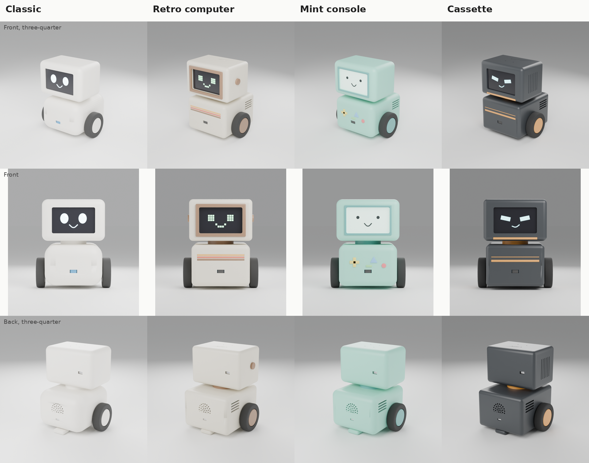
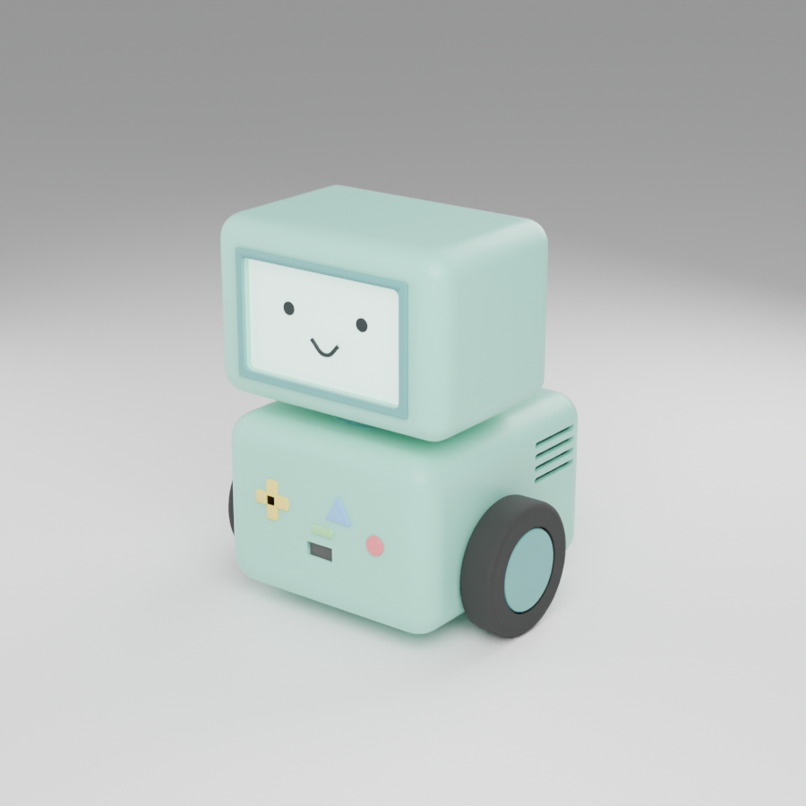
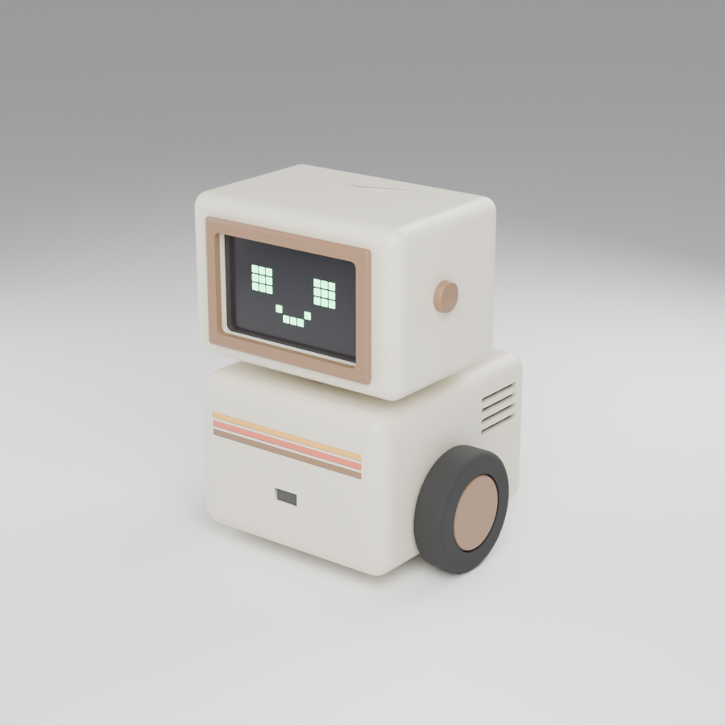
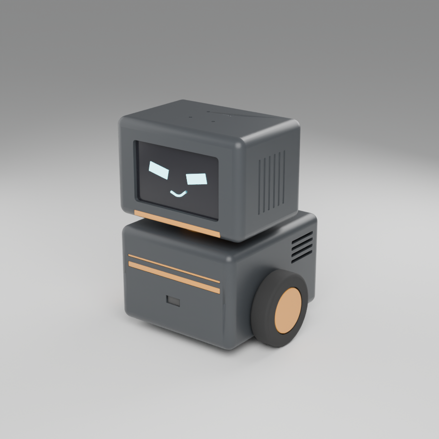
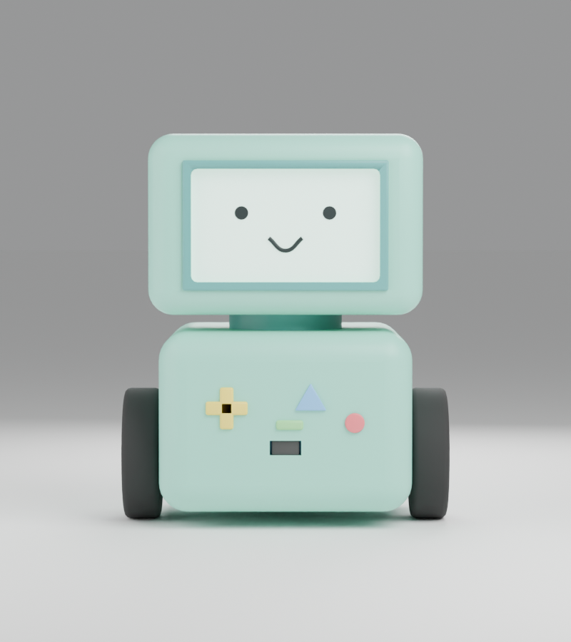

# Milo: shell styles (R9)

You asked for shells that make Milo a cool friend rather than an animal, with BMO vibes from Adventure Time, and you ruled out Minimal and Creature. So there are three new styles next to the Classic one. Status: **Proposed**, for you to pick from or mix.

All four share the same hardware and the same outer envelope: **160 x 135 x 190 mm**, the same printed internals (cradle, motor clamps, skid, collar) and the same bought parts. Only the two shells, a few small trim parts and the colours change, so you can pick a style late, or print a second shell set later, without touching the electronics. This is the "different looks, same brain" idea from the concept render.

## The styles

### 1. Mint console (BMO-inspired)

The one closest to what you asked for. A teal-mint body like a handheld game console, a wide pale screen with a thin darker rim, and the front panel carries the four little controls: a yellow D-pad, a blue triangle, a red round button and a green pill, with the distance-sensor window reading as a cartridge slot.

- The face is software: pale mint screen, two black dot eyes and a small smile. On the real display that is just another face theme; the simulator does not have it yet.
- The controls are decorative printed parts in four colours, 1.5 mm proud of the front. The body front is set back 1.5 mm to pay for that, so the depth stays at 135 mm.
- It is inspired by BMO, not a copy: the proportions, the separate head and body, the wheels and the details are our own. Fine for a personal robot; if you ever planned to sell it, change the look more.
- BMO's thin stick arms and legs are not here. Arms are parked (design log row 11), but a pair of simple printed arms is the obvious next step if you want to go further.

### 2. Retro computer

An early-1980s home computer: beige shell, tighter corners, a thick brown frame around the screen like a CRT bezel, a three-colour stripe across the front (orange, red, brown), and a small dial on each side of the head. The face is green pixels on black, like a terminal.

### 3. Cassette (dark and orange)

The "cool" one. Charcoal shell with orange accents: two bands across the front, a chin band under the screen, orange wheel caps and neck, six grip grooves on each side of the head. The face has half-lidded cyan eyes and a small smirk, which is what makes it look confident rather than cute.

### 4. Classic

The rounded cream shell you already have. Still on the table, but the new three are closer to your brief.

## What is different in each

| | Classic | Retro | Mint | Cassette |
|---|---|---|---|---|
| Body corner radius | 24 mm | 10 mm | 14 mm | 8 mm |
| Head corner radius | 12 mm | 8 mm | 12 mm | 8 mm |
| Size (W x D x H) | 160 x 135 x 190 | 160 x 135 x 190 | 160 x 135 x 190 | 160 x 135 x 190 |
| Whole robot | 956 g | 1005 g | 976 g | 997 g |
| Printed parts, total | 410 g | 459 g | 430 g | 451 g |
| Centre of mass behind the axle | 5 mm | 4 mm | 5 mm | 5 mm |
| Mic array to head roof curve | 0.2 mm | 1.4 mm | 0.2 mm | 1.4 mm |
| Side cooling slots | no | yes | yes | yes |

Notes:

- **The balance holds in every style.** The centre of mass stays 4 to 5 mm behind the axle, so Milo still rests on its skid.
- **Tighter corners help the head.** The 70 mm microphone disc only just fits under the head's rounded roof in Classic and Mint (0.2 mm); with 8 mm corners (Retro, Cassette) there is 1.4 mm to spare. If the real microphone board turns out bigger, those two styles cope better.
- **The side cooling slots are new.** Eight slots in the upper shell, behind the wheels and level with the Pi's cooler. They answer part of the open cooling question from round 8 (the Classic shell has none). I have not tested the airflow or the heat.

## Extra printed parts per style

These come on top of the 9 shared designs in `docs/3d-mockups.md` (P01 to P09). Most are small flat pieces that are printed in a second colour and glued into a pocket in the shell, or painted. If you only have a one-colour printer, paint them or use stickers. Weights are estimates.

**Retro**

| # | Part | Pieces | Size (mm) | About |
|---|------|--------|-----------|-------|
| P10 | Front stripe, orange | 1 | 98 x 3.6 x 1.2 | 0.4 g |
| P11 | Front stripe, red | 1 | 98 x 3.6 x 1.2 | 0.4 g |
| P12 | Front stripe, brown | 1 | 98 x 3.6 x 1.2 | 0.4 g |
| P13 | Screen lip | 1 | 104 x 68 x 4 | 9 g |
| P14 | Side dial | 2 | 16 dia x 5 | 1 g each |

**Mint console**

| # | Part | Pieces | Size (mm) | About |
|---|------|--------|-----------|-------|
| P10 | D-pad, yellow | 1 | 20 x 20 x 2.5 | 0.7 g |
| P11 | Triangle button, blue | 1 | 15 x 13 x 2.5 | 0.3 g |
| P12 | Round button, red | 1 | 9.5 dia x 2.5 | 0.2 g |
| P13 | Pill button, green | 1 | 13 x 4.6 x 2.5 | 0.1 g |
| P14 | Screen rim, dark teal | 1 | 98 x 62 x 2 | 2.6 g |

**Cassette**

| # | Part | Pieces | Size (mm) | About |
|---|------|--------|-----------|-------|
| P10 | Front band, wide, orange | 1 | 100 x 5 x 1.2 | 0.6 g |
| P11 | Front band, thin, orange | 1 | 100 x 2 x 1.2 | 0.2 g |
| P12 | Chin band, orange | 1 | 92 x 5 x 1.4 | 0.6 g |

In every style the neck collar and the hub caps (P04, P07) take the accent colour, and the head shell and body shells are the main colour. The two shells also change: the upper body shell gets the side cooling slots (and stripe pockets in Retro and Cassette), the Cassette head shell gets the grip grooves, and the bezel gets a pocket for the chin band.

## Open questions for you

- **Which one, or which mix?** For example the Mint body with the Cassette face, or the Mint console in a different colour (BMO's teal is one option; a warm yellow or coral would also work).
- **Colours and printing.** Do you want a one-colour print that you paint, or a multi-colour print service? That decides whether the small trim pieces are printed or painted.
- **Arms.** Do you want to bring the parked arms forward for the Mint style, since BMO's stick arms are a big part of the look?
- **Face themes.** Should the simulator get matching face themes (pale mint with black dots, green pixels, cyan half-lids)? That is software only, and it would let you try the looks without printing anything.

## How these were made

The same script as before (`cad/milo_mockup.py`) with a small style layer on top (`cad/milo_styles.py`). Run `python cad/milo_styles.py` to redo all the renders, or `python cad/milo_styles.py mint` for one; `python cad/milo_styles.py report` prints the fit and weight numbers in the table above. This is still a mock-up, not print-ready CAD (see the limits in `docs/3d-mockups.md`).

